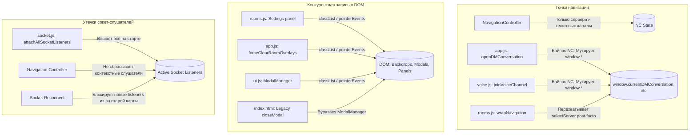
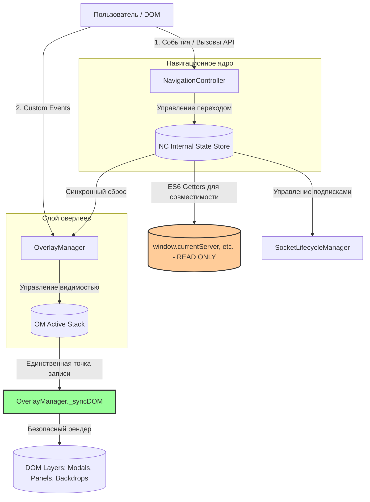

# Архитектурный план трансформации: Переход к Controlled Single Ownership Architecture

Этот документ представляет собой системный план перевода клиентской архитектуры приложения из хаотичного состояния распределенного управления (distributed uncontrolled UI state) в структурированное состояние единого владения (controlled single ownership).

---

## 1. Архитектурная карта текущей системы (Анализ хаоса)

В текущем состоянии кодовая база страдает от **конкурирующих писателей (Multi-Writers)** и отсутствия координации между логическими слоями:



### Корневые дефекты текущей модели:
1. **Навигационный байпас (Bypasses)**: `NavigationController` управляет только серверами и каналами. Навигация по ЛС (DM) и голосовым каналам написана процедурно в `app.js` и `voice.js`, напрямую мутируя `window.*` и вызывая несинхронизированные перерисовки.
2. **Конкуренция за оверлеи (Overlay Race)**: Манипуляция классами `.hidden`, `.visible` и стилем `pointer-events` размыта по 4 файлам. Глобальный метод `closeModal` в `index.html` переопределен legacy-скриптом, ломая стек модальных окон.
3. **Бесконтрольный жизненный цикл сокетов**: Контекстные и голосовые слушатели (`message:new`, `voice:members_update`, `webrtc:*`) вешаются один раз при коннекте и никогда не очищаются, вызывая утечки памяти. При реконнекте дублирующая защита блокирует навешивание слушателей на новый сокет, делая клиента "глухим".

---

## 2. Целевая архитектура (Controlled Single Ownership)

Мы переходим к жесткой **трехуровневой Clean-архитектуре**, где каждый системный ресурс имеет строго одного владельца (Single Owner) и единственную точку записи в DOM (Single Writer).



### Основные компоненты целевой архитектуры:
1. **Unified Navigation Controller**: `NavigationController` берет под контроль 100% переходов в приложении (Servers, Channels, DMs, Rooms, Voice, Welcome). Методы в `app.js` и `voice.js` становятся тонкими прокси-вызовами к контроллеру.
2. **Unified Overlay Manager**: Существующий `ModalManager` расширяется до `OverlayManager`. Он становится **единственным писателем в DOM** для всех модалок, размытий и выдвижных панелей через единый метод `_syncDOM()`.
3. **Dynamic Socket Lifecycle**: Подписки на сокеты группируются по скоупам и очищаются синхронно с навигационными переходами (`detachScope('context')` при смене канала, `detachScope('voice')` при выходе из войса).
4. **Immutable window.\* (ES6 Getters)**: Глобальные переменные `window.currentServer`, `window.currentChannelId` и т.д. переопределяются как **ES6-геттеры**, считывающие данные напрямую из актуального стейта `NavigationController`. Прямая запись в них из внешних файлов запрещается.

---

## 3. Пошаговый план миграции (Incremental Roadmap)

Трансформация проводится поэтапно, без остановки работы приложения и без масштабного переписывания legacy-кода.

### Шаг 1: Стабилизация слоя оверлеев и модальных окон (Наивысший приоритет)
* **Цель**: Полностью убрать застревание бэкдропов и блокировку кликов.
* **Действия**:
  1. Реализовать `OverlayManager` в `ui.js` с поддержкой декларативного стека `state.activeOverlays` и единственной точкой записи `_syncDOM()`.
  2. Заменить legacy-определение `closeModal(id)` в `index.html` (строка 1951) на прокси-метод, делегирующий вызов в `OverlayManager.close()`.
  3. Перевести открытие и закрытие слайд-панели настроек в `rooms.js` на отправку кастомных событий `overlay:open` и `overlay:close`, полностью удалив из `rooms.js` прямые DOM-манипуляции с классами и `pointer-events`.
  4. Заменить императивный клинап `forceClearRoomOverlays()` в `app.js` на вызов события `overlay:closeAll`.

### Шаг 2: Устранение навигационного байпаса (DMs & Voice)
* **Цель**: Объединить все навигационные переходы под эгидой `NavigationController`.
* **Действия**:
  1. Реализовать методы `navigateToDM(conversationId)` и `navigateToVoice(channelId)` внутри `NavigationController` на базе существующего стейт-автомата.
  2. Перенести в эти методы логику инкремента sequence-чисел (`globalSeq`, `requestSeq`), предотвращающую асинхронные гонки.
  3. Отрефакторить `openDMConversation` в `app.js` и `joinVoiceChannel` в `voice.js` так, чтобы они делегировали управление в `NavigationController`.

### Шаг 3: Закрепление DOM Ownership и защита window.\* переменных
* **Цель**: Предотвратить неконтролируемые мутации глобального состояния.
* **Действия**:
  1. Переопределить `window.currentServer`, `window.currentChannelId`, `window.currentDMConversation`, `window.currentVoiceChannel` через геттеры:
     ```javascript
     Object.defineProperty(window, 'currentServer', {
       get: () => window.NavigationController.getCurrentState().currentServer,
       configurable: true
     });
     ```
  2. В дев-режиме добавить сеттеры, которые выдают предупреждение или ошибку в консоль при попытке прямой перезаписи (например, `window.currentServer = null`), указывая разработчику на необходимость вызова методов контроллера.

### Шаг 4: Связывание жизненного цикла сокетов с навигацией
* **Цель**: Искоренить утечки памяти и зависание слушателей событий.
* **Действия**:
  1. Добавить вызовы `detachScope('context')` при переходах между текстовыми каналами/DM внутри `NavigationController`.
  2. Добавить вызов `detachScope('voice')` при отключении от голосового канала внутри `leaveVoiceChannel()`.
  3. Исправить баг повторной инициализации в `socket.js` (`initSocket`): принудительно очищать карту слушателей перед созданием нового сокета, предотвращая "оглушение" клиента.

---

## 4. Риски каждого шага и стратегии их минимизации

| Шаг миграции | Потенциальный риск (Что может сломаться) | Стратегия минимизации / Безопасный откат |
| :--- | :--- | :--- |
| **Шаг 1: Оверлеи** | CSS-анимация выдвижной панели настроек (`rooms.js`) может дергаться при асинхронном скрытии. | Сохранить отложенное добавление класса `.hidden` через стейт-контролируемый `setTimeout` внутри `_syncDOM` (250мс), имитирующий оригинальный переход. |
| **Шаг 2: Навигация** | Легаси-обработчики событий клика на каналы (генерируемые через HTML-строки в `renderChannelItem`) могут вызывать устаревшие методы. | Сохранить глобальные сигнатуры `selectChannel` и `selectServer` как тонкие прокси-обертки над методами `NavigationController`. |
| **Шаг 3: window.\*** | Сторонние модули (например, `founder.js` или `roles.js`) могут использовать прямую запись в `window.currentUser` или `window.currentServer`. | Оставить свойство `window.currentUser` мутабельным на переходный период, защитив геттерами только навигационные переменные (`currentServer`, `currentChannelId`). |
| **Шаг 4: Сокеты** | При быстром переподключении сокета некоторые события могут быть временно пропущены в момент перепривязки. | Выполнять отписку `detachAllListeners()` и привязку `attachAllSocketListeners()` в одной синхронной микрозадаче без `await` задержек. |

---

## 5. Минимальный первый шаг (Production-Safe)

Наиболее безопасным, локализованным и критически важным первым шагом является **исправление легаси-конфликта в `index.html` и изоляция кликабельных хитбоксов настроек комнат**:

1. **Исправление в `index.html`**:
   Изменение глобальной функции `closeModal(id)` в `index.html`, чтобы она проверяла существование `ModalManager`/`OverlayManager` и вызывала его методы. Это устраняет вечную блокировку скролла на странице и не несет никаких рисков для стабильности.
2. **Изоляция оверлея комнат**:
   Перевод слайд-панели настроек комнаты `rooms.js` на кастомные события `overlay:open`/`overlay:close` без прямого доступа к стилям `pointer-events` в `rooms.js`. Это сразу исключает блокировку кликов в чатах комнат, не затрагивая ядро навигации или логику сокетов.
