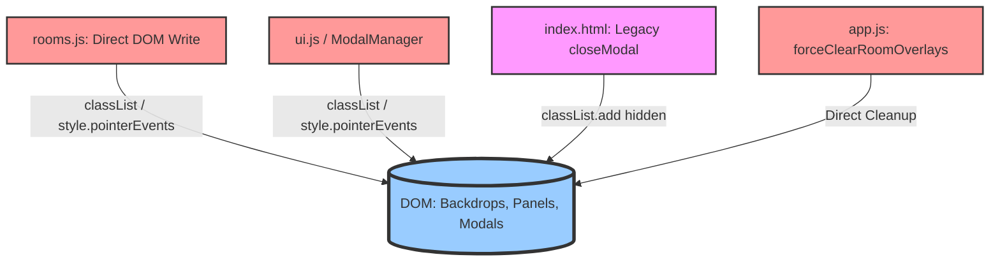
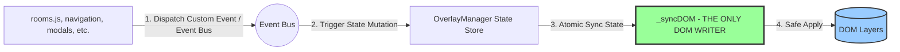

# Архитектурное предложение: Единый источник правды для UI-состояния оверлеев (Single-Writer UI State Architecture)

Этот документ описывает переход от конкурирующих писателей в DOM (Multi-Writer DOM access) к **предсказуемому и централизованному управлению жизненным циклом оверлеев** с единым источником правды.

---

## 1. Результаты аудита: Почему текущая система нестабильна

В ходе детального аудита кодовой базы были обнаружены **три фундаментальные уязвимости**, которые вызывают блокировку интерфейса (hitbox interception) и рассогласование состояния:



### 🔍 Ключевые находки аудита:

1. **Конкурирующие писатели в DOM (Multi-Writer Conflict)**:
   * `rooms.js` (`openRoomSettings`/`closeRoomSettings`) напрямую пишет в DOM, переключая классы `hidden/visible` и изменяя `style.pointerEvents` для `room-settings-panel` и `room-settings-backdrop`.
   * `app.js` (`forceClearRoomOverlays`) также выполняет прямые манипуляции с DOM для сброса слоев.
   * `ui.js` (`ModalManager.open`/`close`) управляет модальными окнами через прямое изменение стилей.
   * *Результат*: Четыре независимых файла конкурируют за одни и те же DOM-ноды, что приводит к рассинхронизации состояния при асинхронных прерываниях.

2. **Критический конфликт переопределения (Legacy Override в index.html)**:
   * **Найдена скрытая причина утечек состояния!** В `index.html` на строке 1951 (после загрузки `ui.js`) объявлена legacy-функция:
     ```javascript
     function closeModal(id) {
       document.getElementById(id).classList.add('hidden');
     }
     ```
   * *Последствия*: Поскольку этот скрипт загружается в самом конце, эта простая функция **перезаписывает** полноценную `closeModal(id)` из `ui.js`. Все инлайновые кнопки закрытия в разметке (`onclick="closeModal('...')``) вызывают legacy-функцию напрямую. DOM скрывается, но элемент **остается зависшим в стеке `ModalManager.stack`**, что ломает scroll-lock, z-index и фокус-трапы!

3. **Невидимые хитбоксы (Hitbox Interception)**:
   * Элементы с `position: fixed` и `z-index: 1200` (такие как `room-settings-backdrop`) при скрытии визуально (через прозрачность или смену классов) сохраняли `pointer-events: auto` или некорректно обрабатывались при резкой смене навигации. Это перехватывало клики, создавая эффект "сломанного интерфейса".

---

## 2. Предлагаемая архитектура: Single-Writer UI State Store

Для полного искоренения этого класса проблем мы внедряем паттерн **State-Driven UI Rendering с единственной точкой записи в DOM**.



### Принципы архитектуры:
1. **Абсолютный запрет на прямой DOM Access**:
   Ни один файл, кроме `ui.js` (внутри `OverlayManager._syncDOM`), больше не имеет права изменять классы `hidden`, `visible`, `pointerEvents`, `aria-hidden` или `zIndex` у элементов оверлеев, подложек и настроек.
2. **Единый источник правды (State Store)**:
   `OverlayManager` хранит декларативное состояние всех активных слоев.
3. **Event-Based Decoupling (Слабая связанность через Event Bus)**:
   Вместо прямого импорта и вызова глобальных методов, компоненты общаются с `OverlayManager` через кастомные события браузера (`overlay:open`, `overlay:close`). Это полностью исключает циклические зависимости и конфликты context-binding.

---

## 3. Формальный инвариант системы (Strict System Invariant)

> [!IMPORTANT]
> **Правило эксклюзивного оверлея (Single Active Overlay Root)**:
> В любой момент времени в системе может существовать только **ОДИН** активный интерактивный оверлей поверх основного контента. 
> Если открывается новый оверлей, все предыдущие должны быть гарантированно и атомарно деактивированы (состояние очищено, DOM-классы скрыты, `pointer-events` сброшены в `none`).

### Правило атомарности переключения:
Применение состояния видимости является **неделимой (транзакционной) операцией**:
$$\text{Overlay Active} \iff \text{Element Visible} \land \text{Backdrop Visible} \land \text{Pointer Events Auto}$$
$$\text{Overlay Inactive} \iff \text{Element Hidden} \land \text{Backdrop Hidden} \land \text{Pointer Events None}$$

---

## 4. Спецификация реализации OverlayManager (в `ui.js`)

Мы модернизируем и расширяем существующий `ModalManager` в полноценный `OverlayManager` с внутренним циклом рендеринга `_syncDOM`.

```javascript
// ui.js
const OverlayManager = {
  // Декларативное состояние
  state: {
    activeOverlays: [] // Стек объектов вида: { id, type, backdropId, config }
  },
  
  baseZIndex: 1000,

  // Инициализация шины событий
  init() {
    window.addEventListener('overlay:open', (e) => {
      const { id, type, options } = e.detail;
      this.open(id, type, options);
    });

    window.addEventListener('overlay:close', (e) => {
      const { id } = e.detail;
      this.close(id);
    });

    window.addEventListener('overlay:closeAll', () => {
      this.closeAll();
    });
    
    console.log('[OverlayManager] Event Bus initialized successfully.');
  },

  // Открыть оверлей (modal, panel, custom)
  open(id, type = 'modal', options = {}) {
    const el = document.getElementById(id);
    if (!el) return;

    // Гарантируем инвариант: один активный оверлей (exclusive по умолчанию)
    if (options.exclusive !== false) {
      this.closeAll();
    }

    // Сохраняем фокус перед открытием первого оверлея
    const previousFocus = this.state.activeOverlays.length === 0 ? document.activeElement : null;

    // Пушим в стейт
    this.state.activeOverlays.push({
      id,
      type,
      backdropId: options.backdropId || null,
      previousFocus,
      allowEscape: options.allowEscape !== false,
      allowClickOutside: options.allowClickOutside !== false,
      onClose: options.onClose || null
    });

    // Атомарно синхронизируем с DOM
    this._syncDOM();

    // Настройка фокуса и локов
    if (type === 'modal') {
      this.enableScrollLock();
      this.setInitialFocus(el, options.initialFocus);
      this.setupFocusTrap(el);
    }
  },

  // Закрыть оверлей
  close(id) {
    const idx = this.state.activeOverlays.findIndex(o => o.id === id);
    if (idx === -1) return;

    const overlay = this.state.activeOverlays[idx];
    
    // Удаляем из стейта
    this.state.activeOverlays.splice(idx, 1);

    // Атомарно синхронизируем с DOM
    this._syncDOM();

    // Снимаем локи
    if (overlay.type === 'modal' && this.getActiveModalsCount() === 0) {
      this.disableScrollLock();
    }

    // Возвращаем фокус
    if (overlay.previousFocus && typeof overlay.previousFocus.focus === 'function') {
      try { overlay.previousFocus.focus(); } catch (e) {}
    }

    // Вызываем коллбек закрытия
    if (typeof overlay.onClose === 'function') {
      try { overlay.onClose(); } catch (e) {}
    }
  },

  closeAll() {
    // Закрываем с конца стека
    while (this.state.activeOverlays.length > 0) {
      const top = this.state.activeOverlays[this.state.activeOverlays.length - 1];
      this.close(top.id);
    }
  },

  getActiveModalsCount() {
    return this.state.activeOverlays.filter(o => o.type === 'modal').length;
  },

  // ==========================================
  // ЕДИНСТВЕННЫЙ ДОПУСТИМЫЙ ПИСАТЕЛЬ В DOM
  // ==========================================
  _syncDOM() {
    const activeIds = new Set(this.state.activeOverlays.map(o => o.id));
    const activeBackdropIds = new Set(this.state.activeOverlays.map(o => o.backdropId).filter(Boolean));

    // 1. Обрабатываем все известные оверлей-элементы в системе
    document.querySelectorAll('.modal-overlay, .room-settings-panel').forEach(el => {
      const id = el.id;
      const isActive = activeIds.has(id);
      const overlayState = this.state.activeOverlays.find(o => o.id === id);

      if (isActive) {
        el.classList.remove('hidden');
        el.style.pointerEvents = 'auto';
        el.setAttribute('aria-hidden', 'false');
        
        // Динамический z-index на основе глубины стека
        const depth = this.state.activeOverlays.findIndex(o => o.id === id) + 1;
        el.style.zIndex = this.baseZIndex + depth * 10;
        
        // Для анимированных панелей
        if (overlayState && overlayState.type === 'panel') {
          requestAnimationFrame(() => el.classList.add('visible'));
        }
      } else {
        el.classList.remove('visible');
        el.style.pointerEvents = 'none';
        el.setAttribute('aria-hidden', 'true');
        
        // Если это анимированная панель, даем время на транзишн, затем вешаем hidden
        if (el.classList.contains('room-settings-panel')) {
          if (!el.classList.contains('hidden')) {
            setTimeout(() => {
              // Делаем финальную проверку, не открыли ли панель снова за время таймаута
              if (!this.state.activeOverlays.some(o => o.id === id)) {
                el.classList.add('hidden');
              }
            }, 250);
          }
        } else {
          el.classList.add('hidden');
        }
      }
    });

    // 2. Обрабатываем все подложки (Backdrops)
    document.querySelectorAll('.room-settings-backdrop, .modal-backdrop, #room-settings-backdrop').forEach(el => {
      const id = el.id || el.className.split(' ')[0];
      const isActive = activeBackdropIds.has(el.id);

      if (isActive) {
        el.classList.remove('hidden');
        el.style.pointerEvents = 'auto';
        
        // Находим оверлей, связанный с этим бэкдропом
        const overlay = this.state.activeOverlays.find(o => o.backdropId === el.id);
        if (overlay) {
          const depth = this.state.activeOverlays.indexOf(overlay) + 1;
          el.style.zIndex = this.baseZIndex + depth * 10 - 1;
        }
        requestAnimationFrame(() => el.classList.add('visible'));
      } else {
        el.classList.remove('visible');
        el.style.pointerEvents = 'none';
        if (!el.classList.contains('hidden')) {
          setTimeout(() => {
            if (!this.state.activeOverlays.some(o => o.backdropId === el.id)) {
              el.classList.add('hidden');
            }
          }, 250);
        }
      }
    });
  },

  // Вспомогательные методы focus trap и scroll lock...
  enableScrollLock() { /* ... */ },
  disableScrollLock() { /* ... */ },
  setInitialFocus(el, selector) { /* ... */ },
  setupFocusTrap(el) { /* ... */ }
};
```

---

## 5. Интеграция с существующим кодом

### А. Подключение к `rooms.js` (Настройки комнаты)
`rooms.js` полностью освобождается от DOM-операций. Открытие и закрытие настроек переводится на вызовы событий:

```javascript
// rooms.js: Открытие настроек комнаты
function openRoomSettings() {
  const server = getCurrentRoomServer();
  if (!server) return;
  fillSettingsForm(server);
  setActiveSection('general');

  // Декларативный запуск через шину событий
  window.dispatchEvent(new CustomEvent('overlay:open', {
    detail: {
      id: 'room-settings-panel',
      type: 'panel',
      options: {
        backdropId: 'room-settings-backdrop',
        onClose: () => {
          console.log('[Rooms] Settings panel closed, layout stabilized');
          requestAnimationFrame(updateNavScrollEdges);
        }
      }
    }
  }));
}

// rooms.js: Закрытие настроек
function closeRoomSettings() {
  window.dispatchEvent(new CustomEvent('overlay:close', {
    detail: { id: 'room-settings-panel' }
  }));
}
```

### Б. Подключение к навигации (Phase 3C)
При любой смене глобального состояния навигации (выборе канала или сервера), контроллер навигации `NavigationController` гарантированно и мгновенно сбрасывает все оверлеи через событие:

```javascript
// navigation-controller.js внутри navigateToServer() и navigateToChannel()
// Вызывается синхронно ДО асинхронных операций
window.dispatchEvent(new CustomEvent('overlay:closeAll'));
```

### В. Безопасное устранение конфликта в `index.html`
Чтобы старые инлайновые обработчики и новые скрипты работали согласованно, мы заменяем legacy-функцию в `index.html` (строка 1951) на безопасный прокси-вызов:

```javascript
// index.html
function closeModal(id) {
  if (window.OverlayManager && typeof window.OverlayManager.close === 'function') {
    window.OverlayManager.close(id);
  } else if (window.ModalManager && typeof window.ModalManager.close === 'function') {
    window.ModalManager.close(id);
  } else {
    // Резервный фолбек на случай, если UI.js еще не загружен
    const el = document.getElementById(id);
    if (el) {
      el.classList.add('hidden');
      el.style.pointerEvents = 'none';
    }
  }
}
```

---

## 6. Почему это решение надежно и безопасно

1. **Исключены гонки писателей (Single Writer Guarantee)**:
   Никакой асинхронный коллбек, тайм-аут или сторонний скрипт не сможет оставить оверлей в промежуточном состоянии (например, убрать класс `visible`, но забыть повесить `hidden` или сбросить `pointer-events`). Рендерер `_syncDOM` всегда приводит DOM в строгое соответствие со стейтом.
2. **Нулевой риск утечек хитбокса (Strict Hitbox Isolation)**:
   Все элементы подложек и панелей при деактивации принудительно получают `pointer-events: none` и `visible: hidden` через атомарную синхронизацию.
3. **Отсутствие усложнений (Legacy-Friendly)**:
   Мы не тащим в проект React/Redux или тяжелые стейт-менеджеры. Мы используем нативный Event Bus браузера (`CustomEvent`) и расширяем проверенный стек-менеджер, сохраняя полную обратную совместимость.
